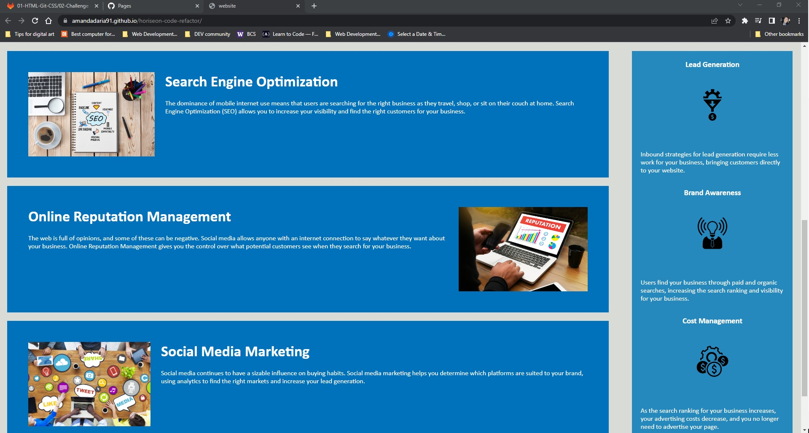

# horiseon-code-refactor

## Description

A more accessible refactor of existing code for a webpage. The code has been restructured using semenatic elements. It has been reorganized using selectors to eliminate redundancy. There has been alt text added to ensure accessibility can be achieved for those useing assisted learning devices. The code was also cleaned up to ensure it's efficiency. 

- My motivation for this project was to build a webpage that was more accessible to ensure it could be accessed using assisted learning devices so those with disabilities can also enjoy the webpage.
- I built this project because I believe that everyone should be able to access this webpage.
- This problem solves the lack of ability to use this webpage had from starting with no accessibility for those with disabilities. 
- I learned and practiced how to use alt text for both HTML and CSS images. I learned how to reorganize code into a more legibile and accessible structure by using semantic elements. I learned how to reduce redundancy in code using selectors and practiced commenting my changes in my work. 

## Table of Contents

- [Installation](#installation)
- [Usage](#usage)
- [Credits](#credits)
- [License](#license)
- [Badges](#badges)
- [Features](#features)

## Installation

No installation or authentication required to view the webpage. 

## Usage

[Link to deployed site](https://amandadaria91.github.io/horiseon-code-refactor/)

## Credits

@UWA-Bootcamp provided starter code of both HTML and CSS, asset images, and instruction into the foundational knowledge of HTML, CSS, and readMe. 

## License

I used an [MIT License](LICENSE).

## Badges

